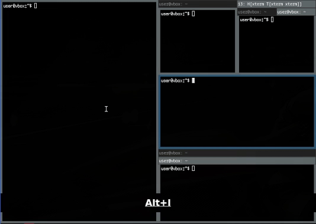

# i3switch - Intuitive i3 Window Switching Utility

We pick tiled window managers to improve our productivity. They allow us to lay out the workspace
in a way that we can see all the necessary information at a glance. This is the superpower of
tiled window managers. And the switching mechanism should follow this mindset. We want to switch
quickly to our layed out windows quickly, intuitively and efficiently.

This is what i3switch is all about. It allows You to switch to what You see, without the necessary
abstraction of the manual tiling structure.

For more history and motivation, see [history.md](docs/history.md).

## Preview

Preview demonstrates directional switching (without touching active tabs) and tab navigation
(preserving focused window in the selected tab).

]

## Features

* **Directional Switching**: Switch to the next window VISIBLE window in the specified direction.
* **Tab Navigation**: Switch to the next window in the current tabbed container.
* **Tab Number Switching**: Switch to the specified tab number in the current tabbed container.
* **Floating Switching**: Switch between floating windows in the direction or windows-like tab
  navigation.
* **Multi-Monitor Support**: Switch windows across multiple monitors, respecting their layout.

## Building & Running

Each implementation has it's own Makefile, default target will build a release binary.

```bash
# Build one language release binary
make -C python
make -C cpp dist/i3switch
make cpp/dist/i3switch

# Build all release binaries
make all

# Build release binaries and packages
# Note: For dependability version must match the current language version git tag.
make i3switch-rs_1.0.0-ubuntu_amd64.deb

# Build changelog
make rust/dist/CHANGELOG.md
```

**Proper binary versioning require .git repository to be present and tags to be fetched.**

## Project Structure

```
i3switch/
├── python/      # Python implementation
├── cpp/         # C++ implementation
├── rust/        # Rust implementation
├── scripts/     # Shared scripts (e.g., changelog generation, builds)
├── .github/
│   └── workflows/  # CI/CD automation (changelog, builds, releases)
└── README.md    # This file
```

Each implementation is self-contained, with its own dependencies, build instructions, and documentation.

## Getting Started

See each subdirectory for build/run instructions:

- [python/README.md](python/README.md)
- [cpp/README.md](cpp/README.md)
- [rust/README.md](rust/README.md)

---

## Automation & CI/CD

- Changelogs are generated from commit history from matching commits.
- Versioning of binaries is handled by Git tags, e.g., `python-vX.Y.Z`, `cpp-vX.Y.Z`, `rust-vX.Y.Z`.

### Reproducibility

With version tags and automated builds, you can always reproduce a specific release of any
implementation, keeping track of changes, features, and bug fixes across languages.

### Changelog Generation

Changelogs are generated with git cliff from commit messages.

To generate a changelog for a specific language implementation, run in git repository root:

```bash
git cliff --config=<LANG>/cliff.toml --output CHANGELOG.md
```

## Contribution

Contributions are welcome! Please see [docs/contribute.md](docs/contribute.md) for guidelines.

## License

[MIT](LICENSE)

---

## Acknowledgements

Thanks to the communities that created such awesome tools like i3, and to the developers
and contributors of the languages used in this project. Your work inspires and enables
projects like this to exist and thrive.
