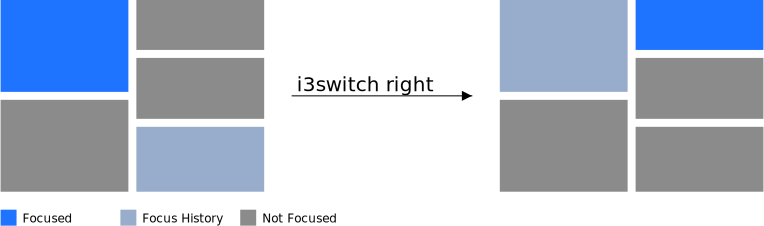

i3switch
===========

Application which aims to make some of the focus movement in i3 more intuitive.

It's initial version was written in python, however python was too slow to start,
so the control felt unresponsive, so I switched to c++

### What does it do

The main goal is to allow to move focus according to the visual space on the
screen, to resolve some of the annoyances of i3.

#### Tabs

One of the main adventages of tiling wms is ability have everythong You need to see simutalniously on single screen.
With that in mind, Your workflow probably involves moving around windows You
see.
That makes the way tabs work in i3 a bit counterproductive, because if You use
tabs, that's probably because You want to hide something that You don't
imidatiely want to see or use (maybe keep for later).
So Your focus movement should in first priority focus around the visual space
You have at hand. The way tabs work, they mess up Your workspace, unless You
want to dive into structures of the windows.

i3switch aims to resolve that issue, giving You a tool that allows to separate
tab switching from focus movement.

Example of the issue:

The movement now can be separated into tab, and directional movement:

#### Visual space movement

Problem with i3 directional movement is that it acknowledges focus history
and containers over focus direction. It of course has it's pros, but often I
expect the focus to move in the direction in relation to the current
container.

Example of bad behaviour without i3switch:

And here's a solution to the problem.

### Current Features

* switch to nth tab/stack of closest ancestor tabbed container

      i3switch number N

* switch to next/previous tab/stack

      i3switch (left|right) [wrap]

  * tab/stack wrapping

    

* visual space focus movement

      i3switch (left | up | right | down) [wrap]

* switch to next/previous floating window

  Switch windows like i3 switches them by default. Same use case as switching tabs, but context is
  different.

* visual space focus floating movement

  Switch windows basing on their middle point. Currently not working properly.

### Planned features

* tests

### Building

    cmake -S . -B build -DCMAKE_BUILD_TYPE=Release
    make -C build
    # or alternatively
    ./build.sh release

### Installation

    sudo make -C build install

### Depends

* i3
* nlohmann/json
* depopt
